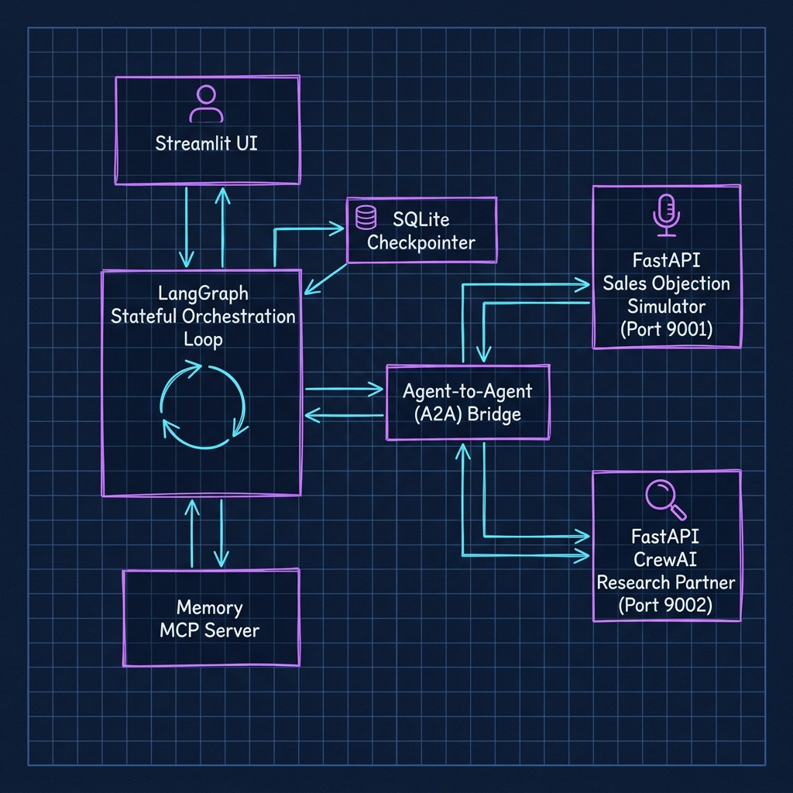
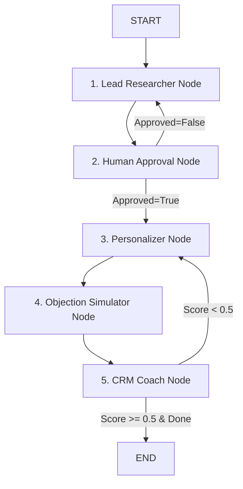

# ⚡ B2B Lead Accelerator Studio

> A state-of-the-art stateful multi-agent system designed for automated, hyper-personalized B2B Sales Development Representative (SDR) campaigns, built with **LangGraph**, **Model Context Protocol (MCP)**, and **CrewAI**.

---

## 📖 Table of Contents
1. [Overview](#-overview)
2. [Core Concepts](#-core-concepts)
3. [System Architecture](#%EF%B8%8F-system-architecture)
4. [Agent Workflow Details](#-agent-workflow-details)
5. [Tech Stack](#%EF%B8%8F-tech-stack)
6. [Prerequisites & Installation](#%EF%B8%8F-prerequisites--installation)
7. [Configuration (`.env`)](#-configuration-env)
8. [Running the Application](#-running-the-application)
9. [Testing & LLM Evaluations (DeepEval)](#-testing--llm-evaluations-deepeval)
10. [Session Memory & Human-in-the-Loop](#-session-memory--human-in-the-loop)

---

## 🌟 Overview

The **B2B Lead Accelerator Studio** is a next-generation AI orchestration platform that automates the standard lifecycle of outbound sales. Unlike traditional sequential scrapers, this system leverages a stateful, event-driven graph architecture that dynamically reacts to prospect feedback, leverages microservice agent collaborations (A2A), and maintains local database-scoped persistence for Human-in-the-Loop checkpointing.

### Key Capabilities:
- **Intelligent Account Mapping**: Evaluates lead materials, company profiles, and target goals to curate high-fit lead lists.
- **Microservice-Augmented Personalization**: Executes real-time research against case studies using dedicated agent networks.
- **Objection Stress-Testing**: Proactively tests personalized hooks using an LLM objection simulator on port `9001` before outreach.
- **Interactive SDR Coaching**: Provides structured feedback loop adjustments until message quality meets B2B outreach standards.
- **Human-in-the-Loop Guardrails**: Features full state checkpointers allowing SDR managers to approve or tweak leads prior to generating value hooks.

---

## 🧠 Core Concepts

| Concept | Explanation |
| :--- | :--- |
| **SDR Agent** | Sales Development Representative Agent that orchestrates the prospect campaign flow. |
| **A2A Service** | Agent-to-Agent microservices designed to handle heavy analytical sub-tasks (e.g., CrewAI research, objection simulations) over lightweight FastAPI sockets. |
| **MCP (Model Context Protocol)** | Standardized agent-to-tool interface allowing agents to read file contents and retrieve context-scoped memory safely. |
| **Interrupt / Checkpointing** | LangGraph State Graph feature that pauses execution state into a SQLite database, yielding control back to a human operator. |
| **DeepEval Verification** | Production LLM unit testing framework that ensures outbound pitch quality, alignment, and hallucination-free generation using quantitative metrics. |

---

## 🗺️ System Architecture

The studio operates on a robust hub-and-spoke model where the **LangGraph Orchestrator** maintains the core transactional state, delegating specialized workloads to independent microservices and checking state against an SQLite backend.

```
                  ┌──────────────────────────────┐
                  │   Streamlit Web Dashboard    │ (app.py)
                  └──────────────┬───────────────┘
                                 │ Starts / Resumes Session
                                 ▼
                  ┌──────────────────────────────┐
                  │    LangGraph Orchestrator    │ (src/graph/workflow.py)
                  └──────────────┬───────────────┘
                                 │
         ┌───────────────────────┼───────────────────────┐
         ▼                       ▼                       ▼
┌──────────────────┐    ┌──────────────────┐    ┌──────────────────┐
│   A2A Port 9001  │    │   A2A Port 9002  │    │    MCP Server    │
│ Objection Service│    │ Sales Research   │    │  Memory Server   │
│  (objection.py)  │    │ Partner (CrewAI) │    │ (memory_server.py)│
└──────────────────┘    └──────────────────┘    └──────────────────┘
```

Below is the **Premium Neon Cyberpunk Architecture Sketch** outlining the complete state transitions and agent topologies:



---

## 🚶 Agent Workflow Details

The system transitions statefully through five primary node types in `src/graph/workflow.py`:



### 1. Lead Researcher Node
- Reads case materials (`lead_materials/`) and maps target profiles.
- Validates contacts and prepares initial prospect state metadata.

### 2. Human Approval Node (Checkpointing Interrupt)
- The state graph persists state and triggers an `interrupt_before`.
- Holds the sequence until the SDR reviews and marks `approved=True` via the Streamlit interface.

### 3. Personalizer Node
- Consults the **Sales Research Partner** (Port 9002) which utilizes **CrewAI** agents to search, digest case studies, and generate deeply grounded outreach hooks tailored to the prospect's unique challenges.

### 4. Objection Simulator Node
- Queries the **Sales Objection Simulator** (Port 9001) which acts as an adversarial prospect raising real-world sales objections (pricing, budget, timing).
- Evaluates the resiliency of the personalized pitch.

### 5. CRM Coach Node
- Evaluates simulation results and computes a readiness score.
- Re-routes prospects back to the personalization stage if the score is subpar or completes the prospect path if it succeeds.

---

## 🛠️ Tech Stack

- **Orchestration**: `langgraph` (v1.1.0) state graph compiler with SQLite checkpointing.
- **Agents & Tools**: `crewai` (v1.13.0) for multi-agent analytical research workflows.
- **Interface Protocol**: `mcp` (Model Context Protocol, v1.26.0) for tool integrations and state memory.
- **FastAPI / Uvicorn**: Lightweight JSON API hosts for the external A2A services.
- **Frontend Dashboard**: `streamlit` (v1.43.2) dynamic control panel.
- **LLM Frontier Orchestration**: `litellm` & `openai` using `gpt-5.2` frontier reasoning models.
- **Test Suite**: `pytest` and `deepeval` (v3.9.1) for evaluating semantic alignment and response quality.

---

## ⚙️ Prerequisites & Installation

### 1. Requirements
Ensure you have **Python 3.10+** and a modern package manager installed.

### 2. Environment Setup
Clone the repository and set up a virtual environment:
```powershell
# Create virtual environment
python -m venv .venv

# Activate virtual environment
.venv\Scripts\Activate.ps1

# Install requirements
pip install -r requirements.txt
```

---

## 🔑 Configuration (`.env`)

Create a `.env` file in the root of the project to set up model endpoint tokens and custom configurations:

```env
OPENAI_API_KEY=your-api-key-here
OPENAI_MODEL=gpt-5.2
USE_A2A_QUIZ=true
USE_STUDY_BUDDY=true
QUIZ_SERVICE_URL=http://localhost:9001
STUDY_BUDDY_URL=http://localhost:9002
CHECKPOINT_DB=data/checkpoints.db
```

---

## 🚀 Running the Application

We provide an automated, multi-threaded system assembly runner (`run_system.py`) that boots up the entire environment (Microservices + Dashboard) in one command:

```powershell
python run_system.py
```

### What this does:
1. Launches the **B2B Sales Objection Simulator Service** on **Port 9001**.
2. Launches the **CrewAI Sales Research Partner Service** on **Port 9002**.
3. Polls the microservice sockets until online.
4. Spins up the **Streamlit Dashboard** UI on **Port 8501**.
5. Gracefully handles `Ctrl+C` to terminate all subprocesses cleanly and free active ports.

To access the Streamlit Dashboard, navigate to `http://localhost:8501`.

---

## 🧪 Testing & LLM Evaluations (DeepEval)

The system features a rigorous automated test bed that combines standard assertion tests with qualitative LLM evaluation metrics.

### Run Standard & Integration Tests:
```powershell
pytest tests/
```

### Run Qualitative LLM Evaluations (DeepEval):
To run tests evaluating whether generated personalized hooks align accurately with source lead materials and do not hallucinate information:
```powershell
pytest tests/test_eval.py
```

These evaluate:
- **Groundedness**: Ensures outreach messages only state facts derived directly from case studies.
- **Persona Alignment**: Assesses whether simulated objections match target industry personas.
- **Response Suitability**: Measures whether the generated SDR outreach is contextually appropriate.

---

## 💾 Session Memory & Human-in-the-Loop

The sqlite database checkpointer tracks states securely inside `data/checkpoints.db`. 

### Resuming campaigns after exit:
If the system or machine crashes during a campaign, the state graph keeps a secure snapshot of every transaction. Simply reload the session ID through the Streamlit dashboard, and the system resumes right where it left off, avoiding redundant API calls and losing research progress!

---

*Made with 💖 for high-performance B2B Sales Teams.*
