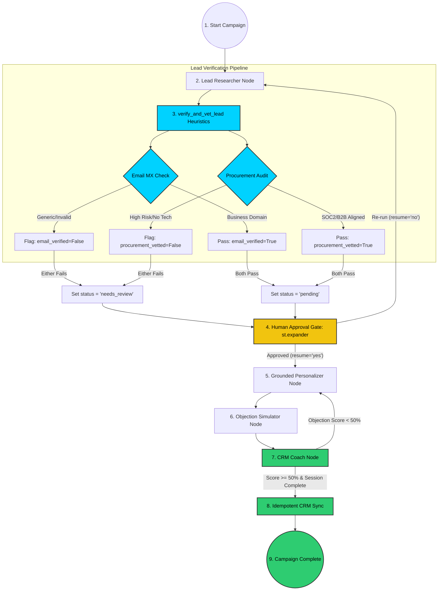

# ⚡ B2B Lead Accelerator Studio

> A state-of-the-art stateful multi-agent system designed for automated, hyper-personalized B2B Sales Development Representative (SDR) campaigns, built with **LangGraph**, **Model Context Protocol (MCP)**, **Agent-to-Agent (A2A)**, and **CrewAI**.

---

## 📖 Table of Contents
1. [Overview](#-overview)
2. [Orchestration, MCP, and A2A Protocols](#-orchestration-mcp-and-a2a-protocols)
3. [Updated System Architecture & Flow](#-updated-system-architecture--flow)
4. [Newly Implemented Capabilities](#-newly-implemented-capabilities)
5. [Tech Stack](#%EF%B8%8F-tech-stack)
6. [Prerequisites & Installation](#%EF%B8%8F-prerequisites--installation)
7. [Configuration (`.env`)](#-configuration-env)
8. [Running the Application](#-running-the-application)
9. [Testing & LLM Evaluations (DeepEval)](#-testing--llm-evaluations-deepeval)
10. [Session Memory & Human-in-the-Loop](#-session-memory--human-in-the-loop)

---

## 🌟 Overview

The **B2B Lead Accelerator Studio** is a next-generation AI orchestration platform that automates the standard lifecycle of outbound sales. Unlike traditional sequential scrapers, this system leverages a stateful, event-driven graph architecture that dynamically reacts to prospect feedback, leverages microservice agent collaborations (A2A), and maintains local database-scoped persistence for Human-in-the-Loop checkpointing.

---

## 🔌 Orchestration, MCP, and A2A Protocols

To ensure modularity and transaction safety at enterprise scale, we decouple workloads using specific frameworks and standards:

### 1. The Core Orchestrator: LangGraph
*   **The Master Hub**: Runs the state graph loop (`workflow.py`). It coordinates state persistence, checkpointing, node execution sequences, and conditional retry flows.
*   **The Nodes**: Houses key campaign milestones: `lead_researcher`, `human_approval`, `personalizer`, `objection_simulator`, and `crm_coach`.

### 2. The Analytical Deep Research: CrewAI
*   **Specialized Sub-Agents**: Operates inside the remote `sales_research_partner.py` service. It structures a dedicated multi-agent team (Research Agent & Analyst Agent) that performs deep-context ingestion, web search, and competitive profiling of target leads.

### 3. Model Context Protocol (MCP)
*   **Tool & Memory Access**: Local agents use our **Memory MCP Server** (`src/mcp_servers/memory_server.py`) to execute tool commands locally:
    *   `tool_search_notes` & `tool_read_file`: Queries local B2B value propositions and case studies.
    *   `tool_memory_set` & `tool_memory_get`: Saves intermediate SDR performance metrics in local thread memory.

### 4. Agent-to-Agent (A2A) Protocol
*   **Cross-Framework Coordination**: Connects our core LangGraph orchestrator with external microservices over lightweight JSON-RPC streaming sockets:
    *   **Personalization** (Port 9002): LangGraph `Personalizer` delegates research prompts to the remote CrewAI service using A2A.
    *   **Adversarial Objections** (Port 9001): LangGraph `Objection Simulator` delegates objection generation and response grading to a remote FastAPI Quiz service using A2A.

---

## 🗺️ Updated System Architecture & Flow

The studio operates on a robust hub-and-spoke model. Below is the complete state execution flow, highlighting the newly integrated **Lead Verification & Vetting** stage, the **Human approval Interrupt**, and the **Transactional Outbox sync**:



---

## 🚀 Newly Implemented Capabilities

To support enterprise readiness and mimic high-throughput workflows (e.g. processing millions of contacts annually), we added two key features to the local system:

### 1. Automated Lead Verification & Compliance Vetting
*   **Deliverability Validation**: Verifies lead email structure and blocks generic consumer domains (Gmail/Yahoo) to enforce strict professional B2B compliance.
*   **Procurement Vetting**: Vets target company descriptions against standard procurement requirements (checks for SOC2/security signals and flags high-risk trade categories).
*   **Dashboard Warnings**: Auto-flags unverified leads as `Needs Review` to halt the LangGraph before personalization, showing detailed audit logs directly inside the Streamlit control panel.

### 2. Transactional Outbox Pattern Manager (`src/utils/outbox.py`)
*   **Atomic Updates**: Writes a `CRM_SYNC` event directly into a local SQL `crm_outbox` table inside the same transaction as the agent state commits, preventing dual-write discrepancies.
*   **Resilient Async Syncing**: An Outbox Daemon pulls pending updates and pushes them to the CRM using **exponential backoff retry policies** to bypass external API rate-limit spikes.

---

## 🛠️ Tech Stack

- **Orchestration**: `langgraph` (v1.1.0) state graph compiler with SQLite checkpointing.
- **Agents & Tools**: `crewai` (v1.13.0) for multi-agent analytical research workflows.
- **Interface Protocol**: `mcp` (Model Context Protocol, v1.26.0) for tool integrations and state memory.
- **FastAPI / Uvicorn**: Lightweight JSON API hosts for the external A2A services.
- **Frontend Dashboard**: `streamlit` (v1.43.2) dynamic control panel.
- **LLM Frontier Orchestration**: `litellm` & `openai` using `gpt-5.2` frontier reasoning models.
- **Test Suite**: `pytest` and `deepeval` (v3.9.1) for evaluating semantic alignment and response quality.

---

## ⚙️ Prerequisites & Installation

### 1. Requirements
Ensure you have **Python 3.10+** and a modern package manager installed.

### 2. Environment Setup
Clone the repository and set up a virtual environment:
```powershell
# Create virtual environment
python -m venv .venv

# Activate virtual environment
.venv\Scripts\Activate.ps1

# Install requirements
pip install -r requirements.txt
```

---

## 🔑 Configuration (`.env`)

Create a `.env` file in the root of the project to set up model endpoint tokens and custom configurations:

```env
OPENAI_API_KEY=your-api-key-here
OPENAI_MODEL=gpt-5.2
USE_A2A_QUIZ=true
USE_STUDY_BUDDY=true
QUIZ_SERVICE_URL=http://localhost:9001
STUDY_BUDDY_URL=http://localhost:9002
CHECKPOINT_DB=data/checkpoints.db
```

---

## 🚀 Running the Application

We provide an automated, multi-threaded system assembly runner (`run_system.py`) that boots up the entire environment (Microservices + Dashboard) in one command:

```powershell
python run_system.py
```

To access the Streamlit Dashboard, navigate to `http://localhost:8501`.

---

## 🧪 Testing & LLM Evaluations (DeepEval)

The system features a rigorous automated test bed that combines standard assertion tests with qualitative LLM evaluation metrics.

### Run Standard & Integration Tests:
```powershell
pytest tests/
```

### Run Qualitative LLM Evaluations (DeepEval):
To run tests evaluating whether generated personalized hooks align accurately with source lead materials and do not hallucinate information:
```powershell
pytest tests/test_eval.py
```

---

## 💾 Session Memory & Human-in-the-Loop

The sqlite database checkpointer tracks states securely inside `data/checkpoints.db`. 

### Resuming campaigns after exit:
If the system or machine crashes during a campaign, the state graph keeps a secure snapshot of every transaction. Simply reload the session ID through the Streamlit dashboard, and the system resumes right where it left off, avoiding redundant API calls and losing research progress!

---

*Made with 💖 for high-performance B2B Sales Teams.*
