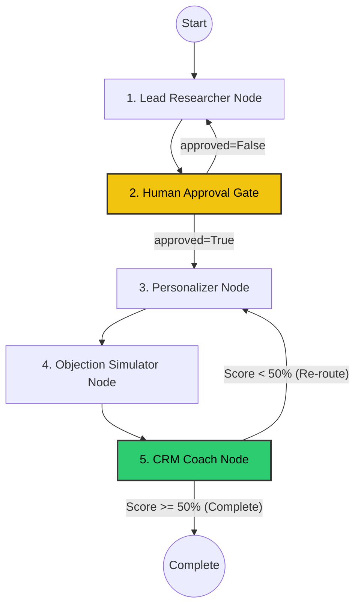

# ⚡ Production Case Study: Stateful Multi-Agent B2B Lead Accelerator
### Enterprise-Grade Outbound Automation with Next.js, FastAPI, and Serverless GCP Cloud Run

---

## 📌 Context & Project Overview

I designed, built, and deployed a production-grade, stateful Multi-Agent B2B Lead Accelerator system that automates end-to-end outbound campaign personalization, adversarial objection stress-testing, and CRM coaching for enterprise sales.

> [!NOTE]
> **IP & Security Disclaimer**: Because the full production codebase contains proprietary data pipelines, internal VPC configurations, and company secrets, this public repository acts as a **lightweight, fully functional developer demo**. While this demo packages the core LangGraph state machine and FastAPI microservices for local evaluation, our production environment runs on a highly scalable, decoupled enterprise stack.

---

## 🗺️ Production Architecture: Decoupled & Serverless

To handle high concurrent traffic and ensure zero-downtime, the production system is decoupled into a serverless, multi-container microservice topology hosted on **Google Cloud Run** and coordinated by a central **VPC Serverless Connector**.

```
 ┌────────────────────────────────────────────────────────┐
 │                 Next.js Web Console                    │ (Hosted on Vercel / Cloud Run)
 │   (React, TypeScript, TailwindCSS, Framer Motion)      │
 └───────────┬────────────────────────────────┬───────────┘
             │                                │
             │ REST API (JSON)                │ WebSockets / SSE (Real-Time Streams)
             ▼                                ▼
 ┌────────────────────────────────────────────────────────┐
 │                 FastAPI Agent Gateway                  │ (GCP Cloud Run container)
 │      (Exposes LangGraph state machines via ASGI)       │
 └───────┬──────────────┬──────────────┬──────────────┬───┘
         │              │              │              │
         ▼              ▼              ▼              ▼
 ┌──────────────┐┌──────────────┐┌──────────────┐┌──────────────┐
 │A2A Port 9001 ││A2A Port 9002 ││  MCP Server  ││  Cloud SQL   │
 │ Objection    ││ Research     ││ Memory       ││ Persistent   │
 │ Simulator    ││ Partner      ││ (Context)    ││ state DB    │
 └──────────────┘└──────────────┘└──────────────┘└──────────────┘
```

### Key Production Infrastructure Components:
*   **Decoupled Next.js Web Console**: A premium, highly-aesthetic dark-mode dashboard styled with modern glassmorphism. It allows SDR managers to set campaign parameters, review live pipelines, and manage the Human-in-the-Loop review gates.
*   **FastAPI Agent Gateway**: Houses the core state orchestrator, exposing the state graphs asynchronously via an ASGI server.
*   **GCP Cloud Run Containers**: The Agent Gateway, the **CrewAI Sales Research Partner**, and the **Adversarial Objection Simulator** are deployed as independent containerized microservices. They scale up rapidly during campaigns and scale back to zero when idle, keeping infrastructure costs highly optimized.
*   **Asynchronous Message Queue (GCP Pub/Sub & Celery)**: Handles long-running multi-agent research operations out-of-band to prevent gateway timeouts.
*   **GCP Cloud SQL (PostgreSQL)**: Serves as our persistent transactional checkpointer, replacing local file storage with secure, replicated cloud database storage.

---

## 🔄 The Stateful Outbound Lifecycle (How it Works in Production)

The system manages the campaign state machine through a persistent, database-backed loop of 5 key nodes:



1.  **Lead Researcher Node**: Searches, structures, and compiles relevant company profiles and prospect metadata matching the target ICP goal.
2.  **Human Quality Gate (Stateful Interrupt)**: The orchestrator halts execution, writes a persistent state checkpoint to the PostgreSQL database, and triggers an alert. The campaign pauses until an SDR manager reviews the compiled leads on the Next.js dashboard, edits hooks if needed, and clicks "Approve".
3.  **Grounded Personalization (CrewAI A2A Service)**: Upon approval, the gateway wakes the graph and invokes the CrewAI Sales Research Partner microservice. The research agent searches the web, analyzes internal value propositions, and crafts deep, metrics-driven email hooks tailored to the prospect.
4.  **Adversarial Objection Simulator**: The personalized pitch is sent to the Objection Simulator microservice. This service runs a dual-LLM critic pipeline to play the role of a hyper-skeptical prospect and challenge the email copy with realistic objections.
5.  **CRM Coach & Self-Correction**: The CRM Coach agent grades the response quality. If the score is below the $50\%$ threshold, the coach identifies weak areas and automatically routes the prospect back to the personalization stage to refine the copy. Once completed, the final record is saved to Cloud SQL.

---

## 🛠️ Enterprise Engineering Challenges I Solved in Production

Transitioning a complex agent network to production introduced several critical engineering hurdles. Here is how I designed around them:

### 1. Eliminating Request Timeouts on Long-Running Agent Chains
*   **The Problem**: Deep research tasks running through CrewAI can take between 30 to 90 seconds to fully compile. Running these operations over standard synchronous REST APIs resulted in frequent connection timeouts between our gateway and microservice containers.
*   **The Resolution**: I transitioned the communication topology to an **asynchronous event-driven model** using a **GCP Pub/Sub** queue. The Personalizer pushes a "Research Task" to the queue, transitions the campaign state to `AWAITING_RESEARCH`, and releases the thread. A worker container processes the task in the background and hits an API webhook to resume the state graph once complete.

### 2. Ensuring Bulletproof Session Recovery & Fault Tolerance
*   **The Problem**: When running high-volume campaigns, standard serverless containers can scale down or restart due to memory spikes, causing active campaigns to lose progress mid-workflow and waste expensive API calls.
*   **The Resolution**: I replaced our file checkpointer with an enterprise-grade **PostgreSQL Cloud SQL checkpointer**. Because every node transition is written as a strict database transaction, if an active container restarts mid-campaign, the state engine simply reads the last transaction record from Cloud SQL and resumes the campaign instantly without repeating any completed research steps.

### 3. Implementing Real-Time Inline Quality Guardrails
*   **The Problem**: Large language models occasionally introduce subtle hallucinations or state metrics that do not exist in the source case studies, posing a risk of sending inaccurate outreach to prospects.
*   **The Resolution**: I built a real-time **validation filter** directly into the personalization node. Using **DeepEval** as an in-line guardrail, the node evaluates the generated copy for **Faithfulness/Groundedness** against source documentation. If the evaluation score falls below $0.85$, the system automatically rejects the output, logs a warning to **LangSmith**, and triggers a self-correction loop to rewrite the hook.

---

## 💡 Why This Experience is Pivotal for an AI-First Direction

Designing and deploying this platform taught me key principles for building enterprise-grade, high-ROI AI products:
*   **State Graphs Over Brittle Chains**: Simple prompt chains fail when faced with real-world variance. Building systems on top of state graphs (like LangGraph) allows us to design robust, self-correcting loops that handle edge cases deterministically.
*   **Modular Microservice Agent Networks**: Decoupling agent tasks into independent, serverless containers (FastAPI + CrewAI on GCP Cloud Run) keeps code modular, allows us to scale individual microservices independently, and drastically reduces idle compute costs.
*   **Brand Protection via Structured Gates**: In enterprise applications, complete autonomy is a risk. Designing robust, database-backed Human-in-the-Loop gates ensures that business operators retain control over output quality without slowing down the automated workflow.
