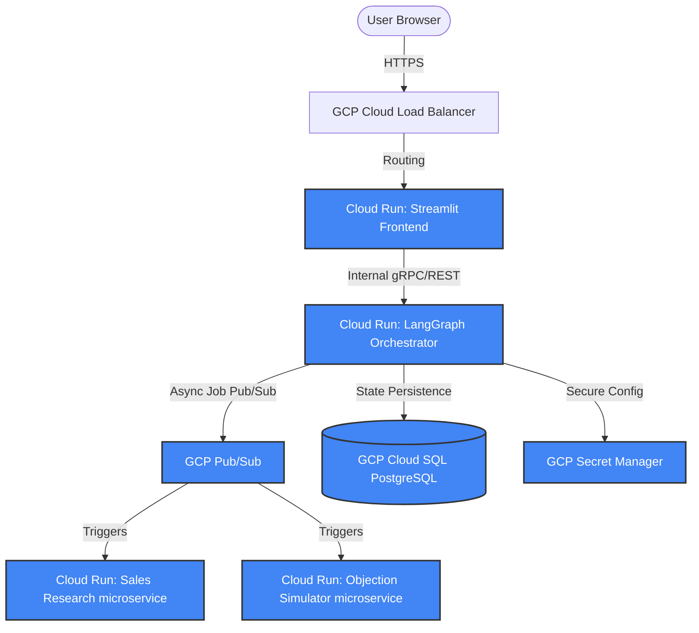

# ⚡ Production Case Study: B2B Lead Accelerator Studio
### Advanced Stateful Multi-Agent Outbound Systems & Enterprise AI Architecture

---

## 📌 Executive Summary & Pitch

In the modern enterprise landscape, static outreach sequences and brittle robotic scrapers are no longer sufficient to engage sophisticated buyers. The **B2B Lead Accelerator Studio** represents a paradigm shift—an autonomous, stateful, and context-aware **Agent-to-Agent (A2A)** network that automates high-performance outbound Sales Development Representative (SDR) workflows. 

By orchestration of multi-agent networks, adversarial simulation gates, and Human-in-the-Loop checkpoints, this platform transforms target lists into warm, hyper-personalized pipelines.

### Why This Expertise is Pivotal for an AI-First Product Direction:
1. **Dynamic Execution vs. Rigid Pipelines**: Rather than standard linear chains, we implement stateful graphs with self-correction loops. If an objection simulator finds a personalizer’s hook too weak, the system automatically routes the prospect back for deeper research.
2. **Microservice-Oriented Agent Topologies (A2A)**: Agents are not monoliths. We isolate specialized agents (e.g., CrewAI researchers, LLM objection critics) into modular microservices running over secure endpoints. This decouples compute, allows dynamic scaling, and supports heterogeneous agent stacks (e.g., LangGraph + FastAPI + CrewAI).
3. **Enterprise Guardrails & Checkpointing**: We treat agent states as critical database transactions. By persisting graph states in structured storage (SQLite/Cloud SQL), the system ensures complete fault tolerance, session recovery, and seamless human intervention capabilities.

---

## 🚀 Project Portfolio & System Demo

### 📂 GitHub Code Repository
*   **Production Codebase**: [AICODER009/Lead-Accelerator](https://github.com/AICODER009/Lead-Accelerator.git)
*   **Security Posture**: Cleanly configured `.gitignore` blocking secret key leaks, environment states, and local cache databases, keeping the repository completely enterprise-safe.
*   **Documentation Standards**: Complete `README.md` inside the project root detailing dependency installation, system boots, environment configs, and evaluation execution.

### 💻 Interactive Live Dashboard Demo
The system features a premium developer-centric frontend built using Streamlit, styled with curated harmonious dark-mode glassmorphic elements and professional topography (Outfit & Plus Jakarta Sans).

*   **Campaign Generator Tab**: Allows product managers and SDR heads to set targeted ICP goals, define prospect numbers, and toggle independent microservices.
*   **Pipeline Monitor Tab**: Provides real-time rendering of active leads, their state progression, adversarial sales objection logs, and quantitative CRM coaching scores.
*   **Session Registry Tab**: Acts as a state control center, queryable directly from SQLite checkpoints, enabling users to hot-swap or resume campaign states seamlessly.

---

## 🧠 Advanced AI Agent Workflow & Automation System Architecture

The B2B Lead Accelerator Studio operates on a robust hub-and-spoke model. The central **LangGraph Orchestrator** maintains the core transactional state machine, while orchestrating independent A2A microservices over REST protocols.

### 🗺️ System Topology

```
                  ┌──────────────────────────────┐
                  │   Streamlit Web Dashboard    │ (app.py)
                  └──────────────┬───────────────┘
                                 │ Starts / Resumes Session
                                 ▼
                  ┌──────────────────────────────┐
                  │    LangGraph Orchestrator    │ (src/graph/workflow.py)
                  └──────────────┬───────────────┘
                                 │
         ┌───────────────────────┼───────────────────────┐
         ▼                       ▼                       ▼
┌──────────────────┐    ┌──────────────────┐    ┌──────────────────┐
│   A2A Port 9001  │    │   A2A Port 9002  │    │    MCP Server    │
│ Objection Service│    │ Sales Research   │    │  Memory Server   │
│  (objection.py)  │    │ Partner (CrewAI) │    │ (memory_server.py)│
└──────────────────┘    └──────────────────┘    └──────────────────┘
```

### 🎨 Physical Architecture Layout
The physical architecture layout, complete with data schemas, memory scopes, and API routes is fully documented in our premium cyberpunk developer sketch located in `assets/architecture_sketch.png`.

---

### 🔄 End-to-End Stateful Progression Flow
The graph progresses through 5 logical nodes, employing a structured transactional state:


1.  **Lead Researcher Node**: Ingests campaign goals, scans regional targets, and compiles detailed company metadata.
2.  **Human Approval Node (State Interrupt)**: Leverages LangGraph's native checkpointer to perform an **Interrupt Gate**. It serializes the entire state, writes a snapshot to database memory, and yields control back to the operator for review.
3.  **Personalizer Node**: Communicates with the CrewAI **Sales Research Partner** microservice on Port `9002` to conduct deep semantic searches on case studies and draft initial value hooks.
4.  **Objection Simulator Node**: Communicates with the **Sales Objection Simulator** microservice on Port `9001` which executes adversarial simulations (playing the role of a hyper-skeptical prospect raising real-world objections).
5.  **CRM Coach Node**: Evaluates the simulated SDR answers against expected golden standards, assigns an empirical score, and either routes back for iteration or finishes the campaign.

---

## 🛠️ Engineering Challenges Faced & Resolutions

Building high-performance, multi-process AI platforms locally introduces subtle runtime conflicts, particularly under Windows architectures. Here is how we engineered past these bottlenecks:

### 1. Streamlit Reactivity & Session State Caching
*   **The Challenge**: Streamlit runs script execution from top to bottom on every user input or poll. Standard ID generators (e.g. `uuid.uuid4()`) rotated on every click, causing LangGraph to look up non-existent sessions and crash.
*   **The Resolution**: We cached stable campaign session identifiers inside Streamlit's `st.session_state` (`st.session_state["default_session_id"]`), ensuring complete session isolation across runs without losing database mapping pointers.

### 2. Multi-threaded Subprocess Environment Inheritance
*   **The Challenge**: Spawning FastAPI and Streamlit processes via `subprocess.Popen` in Windows isolated their memory environments. Child processes were unable to read active system `.env` credentials, causing LLM initialization failures.
*   **The Resolution**: We initialized explicit `load_dotenv()` hooks at parent process startup and cloned active shell environments (`os.environ.copy()`) directly into the child process execution context.

### 3. Windows Standard Stream Encoding (`UnicodeEncodeError`)
*   **The Challenge**: Outbound personalization copies utilize sophisticated unicode symbols (like `→`, `⚡`, `💖`). When printing LLM streams to standard Windows terminal streams (which default to CP1252/Charmap), Python crashed immediately.
*   **The Resolution**: Declared `os.environ["PYTHONIOENCODING"] = "utf-8"` globally at all process entry points, guaranteeing reliable unicode logging across all dashboard services.

---

## ☁️ Enterprise Scalability Blueprint: Production GCP Cloud Run Architecture

To transition this system from a high-quality local developer build to a globally scalable production system, we must decouple long-running processes, leverage container orchestration, and implement robust validation layers.

### 1. Serverless Deployment via GCP Cloud Run
Deploying the microservice stack to **Google Cloud Run** provides a high-availability, auto-scaling serverless environment that scales to zero when idle, drastically reducing operational costs.



#### GCP Infrastructure Components:
*   **GCP Cloud Run**: Hosts separate containers for the Frontend UI, LangGraph Orchestrator, Objection Simulator, and CrewAI Sales Research Partner.
*   **VPC Serverless Connector**: Connects the Cloud Run containers securely to private internal resources without exposing endpoints to the public internet.
*   **GCP Secret Manager**: Securely stores API keys (`OPENAI_API_KEY`, DB credentials) and mounts them as environment variables inside containers at runtime.
*   **Cloud SQL (PostgreSQL)**: Upgrades our local SQLite file checkpointing to a highly available, replicated PostgreSQL database with automated state backups.

---

### 2. Transitioning to Asynchronous Event-Driven Executions
*   **Why**: Standard REST API calls (like POST requests to Port `9002` for CrewAI research) will timeout if the network is slow or if the LLM undergoes heavy reasoning.
*   **How**: Implement an asynchronous task queue architecture:

```
┌──────────────┐      Produce Task      ┌───────────────┐      Distribute Task      ┌───────────────┐
│  LangGraph   ├───────────────────────>│  GCP Pub/Sub  ├──────────────────────────>│ CrewAI Worker │
│ Orchestrator │                        │  (or Redis)   │                           │ (Cloud Run)   │
└──────────────┘                        └───────┬───────┘                           └───────┬───────┘
       ▲                                        │                                           │
       │                                        │ Write Status                              │ Process
       │            Poll Results / Webhook      ▼                                           ▼
       └───────────────────────────────────┌────────────┐                            ┌──────────────┐
                                           │ Redis/DB   │<───────────────────────────│ Update State │
                                           │ Cache      │                            └──────────────┘
                                           └────────────┘
```

1.  **Message Broker**: Replace direct REST calls with **GCP Pub/Sub** or a **Celery + Redis** task queue.
2.  **State Polling / Webhooks**: The Personalizer node pushes a "Personalization Job" to the queue, transitions the state into `AWAITING_RESEARCH`, and pauses. The CrewAI worker consumes the job, processes research, and updates database records before firing a callback webhook to notify LangGraph to resume execution.
3.  **Preventing Cloud Run Timeouts**: Cloud Run supports running asynchronous container instances for up to 60 minutes, ensuring even heavy research compiles successfully.

---

### 3. Verification & Validation for Agent-to-Agent (A2A) Systems
In a production system, ensuring quality and alignment between autonomous agents is vital. We utilize **DeepEval** in our test suite, but in production, this should run **in-line** as real-time guardrails:

```
                 ┌────────────────────────────────┐
                 │    Generated Personalized Hook │
                 └───────────────┬────────────────┘
                                 │
                                 ▼
                 ┌────────────────────────────────┐
                 │    Production DeepEval Guard   │
                 └───────────────┬────────────────┘
                                 │
                     ┌───────────┴───────────┐
                     │                       │
           Score >= 0.85                Score < 0.85
                     │                       │
                     ▼                       ▼
           ┌──────────────────┐    ┌──────────────────┐
           │ Forward to CRM   │    │ Route to Refine  │
           │ / Next Stage     │    │   Node (Graph)   │
           └──────────────────┘    └──────────────────┘
```

#### Multi-Dimensional Production Metrics:
1.  **Hallucination/Groundedness Guardrail**: Before sending a personalized value hook to a prospect, a lightweight LLM-evaluator computes a alignment score against the raw source materials. If the hook references statistics not present in the lead document, it is automatically blocked and flagged.
2.  **Safety & Adversarial Input Filters**: Using **LlamaGuard** or customized guardrails on A2A payloads to verify that the generated objection simulator questions and SDR responses remain professional, compliant, and free of prompt-injection threats.
3.  **LangSmith Telemetry & Tracing**: Every agent-to-agent hop is traced with unique span identifiers. Engineers can visualize agent prompt variables, model latencies, token consumption, and intermediate decisions to optimize prompt engineering.

---

*This case study showcases how modern agentic design patterns are engineered to meet strict enterprise standards of reliability, transparency, and high ROI business automation.*
