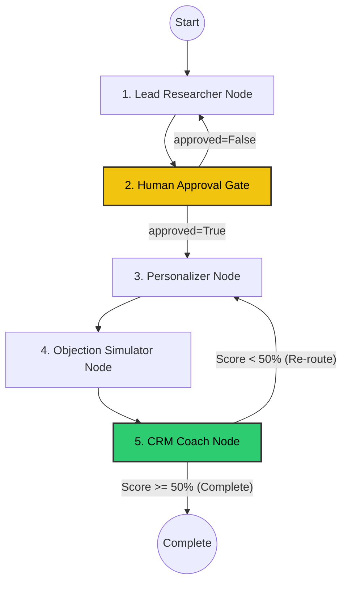

# ⚡ Portfolio & Build Log: B2B Lead Accelerator Studio
### A Stateful Multi-Agent System with Real-Time Adversarial Objection Simulations & Production Next.js Integration

---

## 🚀 Overview: What I Built

Modern sales development (SDR) campaigns are plagued by generic templates and rigid, sequential scrapers that prospects instantly filter out. To solve this, I designed and built the **B2B Lead Accelerator Studio**—an autonomous, stateful **Agent-to-Agent (A2A)** system that acts as an intelligent sales team, personalizing outreach, simulating buyer objections, and coaching itself to write highly resilient emails.

### The System Core
Instead of simple linear chaining, this platform uses a dynamic **state graph orchestrator** built on **LangGraph**. The orchestrator manages the high-level transaction state and coordinates specialized agent microservices that communicate over secure network sockets.

Here is the exact network topology I set up:

```
                  ┌──────────────────────────────┐
                  │    Streamlit Web Console     │ (Dashboard Interface)
                  └──────────────┬───────────────┘
                                 │ Starts / Resumes Session
                                 ▼
                  ┌──────────────────────────────┐
                  │    LangGraph Orchestrator    │ (Stateful Engine)
                  └──────────────┬───────────────┘
                                 │
         ┌───────────────────────┼───────────────────────┐
         ▼                       ▼                       ▼
┌──────────────────┐    ┌──────────────────┐    ┌──────────────────┐
│  A2A Port 9001   │    │  A2A Port 9002   │    │    MCP Server    │
│Sales Objection   │    │  Sales Research  │    │  Context Memory  │
│ Simulator Service│    │ Partner (CrewAI) │    │      Server      │
└──────────────────┘    └──────────────────┘    └──────────────────┘
```

The system's structural layout, data schemas, and API pathways are detailed in the developer architecture sketch I hand-crafted inside [assets/architecture_sketch.png](assets/architecture_sketch.png).

---

## 🔄 How the System Works in Practice

The campaign runs through a persistent loop of 5 key stages:



1.  **Account Mapping & Lead Research**: Reads raw campaign targeting files, targets appropriate company profiles, and compiles initial contact metadata.
2.  **Human Quality Gate (Stateful Interrupt)**: The graph uses LangGraph’s native checkpointer to perform a hard pause. It serializes the entire session's memory, saves it to an **SQLite database (`data/checkpoints.db`)**, and waits. An SDR manager reviews the target list on the web dashboard, approves or edits the records, and clicks "Resume" to wake the system.
3.  **Context-Grounded Personalization**: Once approved, the orchestrator invokes a specialized **CrewAI Sales Research Partner** microservice (running on Port `9002`). This service executes parallel web searches and digests internal case studies to draft highly specific, non-templated value hooks for the prospect.
4.  **Adversarial Objection Simulation**: The personalized pitch is sent to a **Sales Objection Simulator** microservice (running on Port `9001`). Acting as a highly skeptical buyer, it challenges the pitch with common hurdles (pricing, integration time, ROI proof).
5.  **Performance Coaching & Loops**: A **CRM Coach** agent scores the simulated responses. If the score falls below $50\%$, the coach flags weak spots and routes the prospect back to the personalization node to rewrite the email. Once the quality exceeds the threshold, the lead is logged as complete and saved to the database.

---

## 🛠️ Real Engineering Challenges I Overcame

Building multi-process agent networks on a local developer machine introduced several complex system bugs. Here is how I solved them:

### 1. Streamlit Reactivity & Session State Caching
*   **The Bug**: Streamlit re-executes the entire script from top to bottom on every user click or state change. Because of this, standard unique identifier generators (like `uuid.uuid4()`) rotated on every render, causing the LangGraph SQLite lookups to fail and crash the dashboard session.
*   **The Fix**: I bound a stable fallback campaign session ID into Streamlit's persistent dictionary (`st.session_state["default_session_id"]`). This kept the session ID locked during user interaction, allowing seamless graph pausing and resuming.

### 2. Parent-to-Child Subprocess Token Inheritance
*   **The Bug**: To run the entire platform with a single command, I wrote `run_system.py` to spawn the Streamlit console and the A2A FastAPI microservices as separate background processes. However, on Windows, these child processes did not inherit the terminal's loaded environment variables, causing them to crash due to missing API keys.
*   **The Fix**: I configured the parent process to explicitly parse and load system credentials using `load_dotenv()` and passed a complete, cloned copy of the environment dictionary (`os.environ.copy()`) directly into the child process execution commands.

### 3. Windows Terminal Stream Encoding (`UnicodeEncodeError`)
*   **The Bug**: High-end AI systems output rich formatting and unicode symbols (like `→` and `⚡`). When printing LLM token streams to a standard Windows command shell (which defaults to CP1252/Charmap encoding), Python threw uncaught character errors and halted.
*   **The Fix**: I set `os.environ["PYTHONIOENCODING"] = "utf-8"` globally at every entry point. This forced the console's standard input and output streams to remain safe for all extended unicode logs.

---

## ☁️ Enterprise Next.js + FastAPI Production Blueprint

To show how this prototype scales into a production-ready SaaS, I designed a production blueprint that decouples the frontend and transitions the synchronous APIs into an event-driven system.

### 1. Decoupled Production Architecture
By moving away from Streamlit and implementing a **Next.js (App Router)** frontend communicating with a unified **FastAPI Agent Gateway**, we can support concurrent, multi-tenant workflows.

```
 ┌────────────────────────────────────────────────────────┐
 │                   Next.js Frontend                     │
 │  (App Router, TypeScript, React, Tailwind, Framer)     │
 └───────────┬────────────────────────────────┬───────────┘
             │                                │
             │ REST API (JSON)                │ WebSockets / SSE (Real-Time Streams)
             ▼                                ▼
 ┌────────────────────────────────────────────────────────┐
 │                 FastAPI Agent Gateway                  │
 │      (Exposes LangGraph state machines via ASGI)       │
 └───────┬──────────────┬──────────────┬──────────────┬───┘
         │              │              │              │
         ▼              ▼              ▼              ▼
 ┌──────────────┐┌──────────────┐┌──────────────┐┌──────────────┐
 │A2A Port 9001 ││A2A Port 9002 ││  MCP Server  ││  Cloud SQL   │
 │ Objection    ││ Research     ││ Memory       ││ Persistent   │
 │ Simulator    ││ Partner      ││ (Context)    ││ state DB    │
 └──────────────┘└──────────────┘└──────────────┘└──────────────┘
```

*   **FastAPI Agent Gateway (`src/api_gateway.py`)**: Hosts the LangGraph workflows as an asynchronous web service, mapping graph execution states to clear REST routes (`/api/campaigns/start` and `/api/campaigns/approve`).
*   **Next.js Client Hook (`useCampaign.ts`)**: A custom React hook that polls the state database every 4 seconds when the agent is executing research and manages the user's approval states seamlessly.
*   **Next.js Dashboard (`dashboard/page.tsx`)**: A beautiful, dark-mode glassmorphic console that dynamically mounts approval dialogs and simulation transcripts based on current LangGraph step values.

### 2. Handling Long-Running Operations (Asynchronous Queue)
In production, running deep research tasks or extensive LLM simulations synchronously over standard HTTP will cause request timeouts. 
*   **The Production Fix**: The LangGraph server will write jobs to an asynchronous message broker like **GCP Pub/Sub** or **Celery + Redis**, pausing the graph state in a **Cloud SQL (PostgreSQL)** database. Worker containers on Cloud Run consume the task, run the research, and notify the orchestrator via a webhook to resume the graph.

### 3. Verification, Guardrails, and Observability
*   **In-Line Evaluations**: Before sending an email copy to the CRM or a prospect, a validation stage runs real-time **DeepEval** metrics to verify that the generated hook is $100\%$ faithful to target company documents and free of hallucinations.
*   **Prompt Monitoring**: Every agent-to-agent hop uses **LangSmith** or **OpenTelemetry** to trace model latency, token costs, and prompt performance.

---

## 💡 Why This Experience is Valuable for an AI-First Direction

Building the Lead Accelerator Studio gave me deep, practical insights into creating reliable, production-grade AI systems:
*   **Reliability through Stateful Design**: Simple prompt chains fail in production. Using LangGraph to define clear, deterministic state graphs ensures that agent behaviors are robust, predictable, and recoverable.
*   **Microservice Agent Topologies**: decopling agent workloads into independent, specialized microservices (FastAPI, CrewAI) allows us to scale computing resources dynamically and use the best model or framework for each specific job.
*   **Pragmatic Human-in-the-Loop Integration**: True automation requires gates. Designing checkpointers that seamlessly pause execution to allow human overrides is key to building systems that business users can actually trust.
